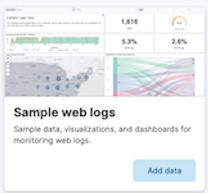
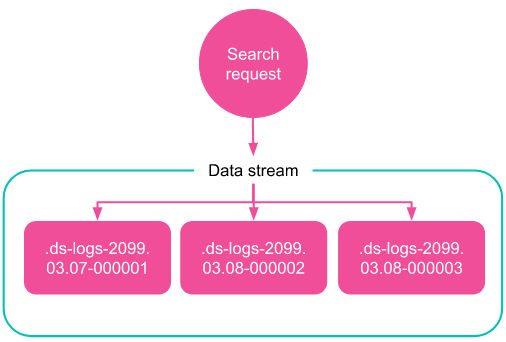
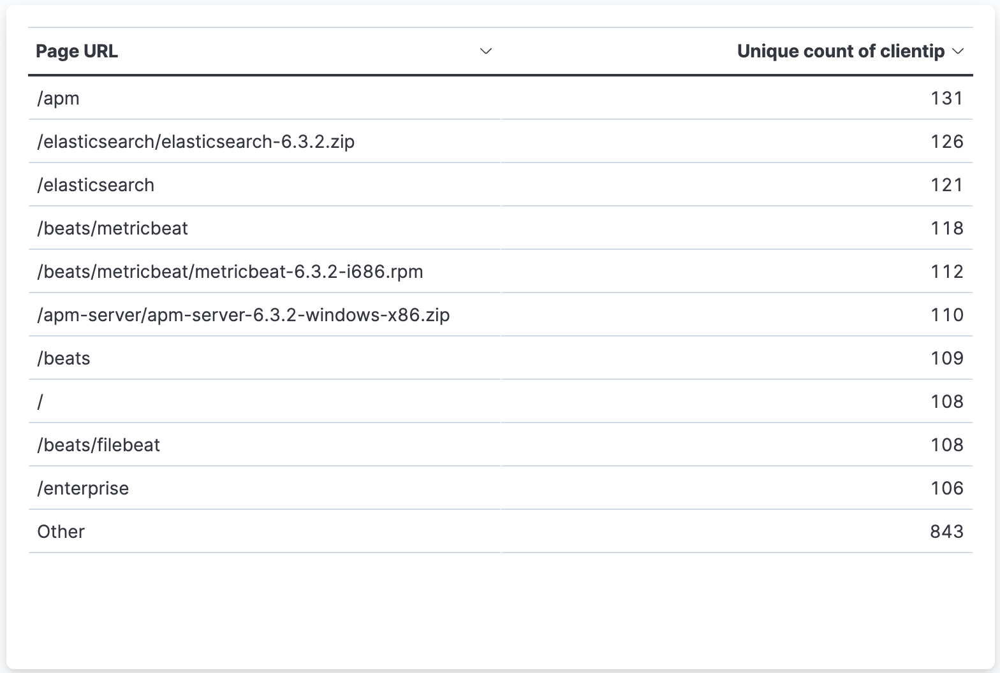
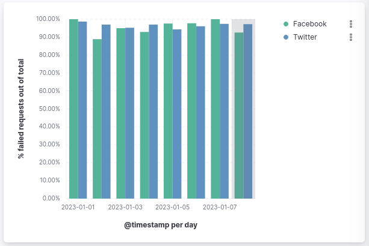
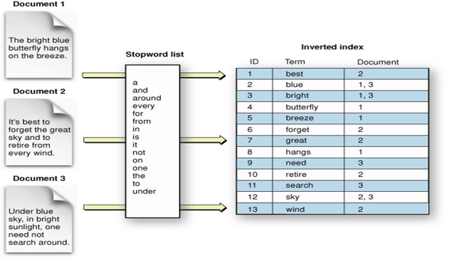

# Monitoring and Alerting

We've reached our last station in the DevOps journey.
As a DevOps engineer, you will use monitoring tools to ensure the continuous health and performance of your services.
Platforms like Grafana, Kibana, Elasticsearch and Prometheus are commonly used to get real-time insights about the service, to trigger alerts when something is wrong, and to efficiently investigate these issues. 

## Elasticsearch and Kibana

**Elasticsearch** is the distributed search and analytics engine.
Elastic is a NoSQL database, can store structured or unstructured text, numerical data, or geospatial data. 
You can easily index data in a way that supports fast searches.

Elastic is a great choice to store and analyze logs, metrics, and security event data. 

**Kibana** is a web-based platform, which allows you to interactively explore, visualize, and get insights about your data. 

The Elasticsearch and Kibana projects (together with many more other projects) are developed and owned by the Elastic organization, and commonly referred as the [ELK stack](https://www.elastic.co/elastic-stack) (Elastic, Logstash, Kibana).
**Elasticsearch** in the database for storing the data, **Logstash** collects and streams the data into Elasticsearch from many different platforms, and **Kibana** provides a user-friendly interface for visualization and exploration. 


## Installation and import sample data

You can install [Elastic](https://www.elastic.co/guide/en/elasticsearch/reference/current/install-elasticsearch.html) and [Kibana](https://www.elastic.co/guide/en/kibana/current/install.html) in any way you like. 

Assuming you know how to work with Docker containers, to start a single-node Elastic instance and a Kibana server follow the official docs:

https://www.elastic.co/guide/en/elasticsearch/reference/current/docker.html

> [!IMPORTANT]
> - Make your Elastic instance persistent by adding the `-v elasticdata01:/usr/share/elasticsearch/data` flag.  
> - Make your Kibana instance persistent, add the `-v kibanadata:/usr/share/kibana/data` flag to create and mount a Docker volume on the host machine.  


> [!NOTE]
> - If the Elastic container stops with exit code 78, perform `sudo sysctl -w vm.max_map_count=262144` (read [Set vm.max_map_count to at least 262144](https://www.elastic.co/guide/en/elasticsearch/reference/current/docker.html#_set_vm_max_map_count_to_at_least_262144) in the above installation docs).
> - No need to run more than a single Elastic node.
> - You can also deploy Elastic in a Kubernetes cluster using the [ECK operator](https://www.elastic.co/guide/en/cloud-on-k8s/current/k8s-deploy-eck.html. 

After installation, access your Kibana server as detailed in the docs.

The welcome page in Kibana may suggest you to add integrations from which Kibana can collect data to monitor and analyse, choose **Explore on my own**,

Now let's add sample data with which we'll be experimenting during the tutorial. 

1. On the home page, click **Try sample data**.
2. Click **Other sample data sets**.
3. On the **Sample web logs** card, click **Add data**.



In the elastic main menu, **Discover** displays the data in an interactive histogram that shows the distribution of data over time, and a table that lists the available fields.
The **Dashboard** displays a collection of panels that visualizing the data.

Take a look on the data as displayed in the Discover page, and on a nice dashboard visualizing this data. 

## Elastic and Kibana core concepts 

### Documents and indices

Elasticsearch stores JSON [**documents** in an **index**](https://www.elastic.co/guide/en/elasticsearch/reference/current/documents-indices.html).
You can efficiently search documents in your index, filter them by timestamp or any other condition. 
You can also aggregate some values in your documents, for example, to sum some value across a group of documents.  

In our context, Elasticsearch will be used to store application logs data.
Each log entry represented as a JSON document and stored in an index. E.g.: 

```json
{
  "agent": "Mozilla/5.0 (X11; Linux i686) AppleWebKit/534.24 (KHTML, like Gecko) Chrome/11.0.696.50 Safari/534.24",
  "bytes": 1538,
  "clientip": "37.68.248.33",
  "geo": {
    "srcdest": "US:US",
    "src": "US",
    "dest": "US",
    "coordinates": {
      "lat": 65.83049389,
      "lon": -144.0758128
    }
  },
  "host": "cdn.elastic-elastic-elastic.org",
  "index": "kibana_sample_data_logs",
  "ip": "37.68.248.33",
  "machine": {
    "ram": 12884901888,
    "os": "win xp"
  },
  "message": "37.68.248.33 - - [2018-09-18T05:33:31.512Z] \"GET /styles/app.css HTTP/1.1\" 200 1538 \"-\" \"Mozilla/5.0 (X11; Linux i686) AppleWebKit/534.24 (KHTML, like Gecko) Chrome/11.0.696.50 Safari/534.24\"",
  "referer": "http://twitter.com/success/l-opold-eyharts",
  "request": "/styles/app.css",
  "response": 200,
  "tags": [
    "warning",
    "info"
  ],
  "@timestamp": "2024-03-05T05:33:31.512Z",
  "url": "https://cdn.elastic-elastic-elastic.org/styles/app.css",
  "utc_time": "2024-03-05T05:33:31.512Z",
  "bytes_gauge": 1538,
  "bytes_counter": 76948722
}
```

As can be seen, these logs may include crucial information such as timestamp, log level, user interactions, and error messages.

### Data streams 

How long should we store logs data? Usually logs data is stored for 30, 60, 90 days... depending on the context. But even if our index contains billions of logs documents from the last 30 days, that can badly affect searching time. 
For example, we can create an index per day, containing only the logs for that day. That way we improve search performance.
But now we have to work with many different indices in case we want to query or aggregate data across multiple days.. 

**Data streams** can be used to automatically divide our documents into a set of indices, while giving you a single named resource for requests.



A data stream consists of one or more hidden, auto-generated backing indices.
You can submit indexing and search requests directly to a data stream. The stream automatically routes the request to backing indices that store the stream’s data.

Every document indexed to a data stream must contain a `@timestamp` field, this kind of data model is call [Time series](https://en.wikipedia.org/wiki/Time_series).

1. Open Kibana main menu, under **Management**, choose **Stack Management**.
2. In the Management pane, under **Data**, choose **Index Management**.
3. Choose the **Data Streams** tab and take a look on the `kibana_sample_data_logs` data stream that was created for you when added the sample logs data. 
4. Choose the **Indices** tab, enable the **Include hidden indices** toggle, type `sample_data_logs` in the search field to filter the underlying index upon which the `kibana_sample_data_logs` is based. 

### Data view

In order to work with the data in Kibana, you have to create a **Data View**. Data view, as it sounds, is a "view" on your data stored in Elastic. 

A Data view can point to one or more indices, data streams, or index.
For example, a Data view can point to your log data from yesterday, or all indices that contain your data.

1. In the **Stack Management** page, under **Kibana**, choose **Data Views**.
2. Validate that the **Kibana Sample Data Logs** data view is based on the `kibana_sample_data_logs` data stream. 


## Kibana Query Language (KQL)

The Kibana Query Language (KQL) is a simple text-based query language for filtering data in the Discover page.

Follow [the KQL short tutorial](https://www.elastic.co/guide/en/kibana/current/kuery-query.html) from Elastic's official docs.

### Practice KQL

Open the **Kibana Sample Data Logs** data view under **Discover** page, and search for the following information:

- Query all logs with response code 200 or 404 from the last 4 days.
- Query all successful requests from last day, referred from `twitter.com`
- Search all documents where the `request` field contains the string `elasticsearch-6.3.2.deb` within the last 7 days.
- According to a bad system design, your platform has to block users from download large files (files larger than `9216` bytes (9KB)) during every day for 30 minutes. The product manager asks your insights regarding the hour in the day that you should apply this limitation. What hour will you advise?
- Click on the **+** button (Add Filter) to displays data when `hour_of_day` value is in between the working hours only (`9-17`).
- What is the maximum requested resource (highest `bytes` request) within the last 7 days, during working hours? Was it responded with `200` status code?

## Kibana Dashboards

The best way to understand your data is to visualize it.
With dashboards, you can turn your data from one or more data views into a collection of panels.

### Create a new dashboard

1. Open the main menu, then click **Dashboard**.
1. Click **Create dashboard**.
1. Set the time filter to **Last 7 days**.
1. On the dashboard, click **Create visualization**.
1. Make sure the **Kibana Sample Data Logs** Data view appears.

### Panel I: Unique visitors

1. Open the **Visualization type** dropdown, then select **Metric**.
1. From the **Available fields** list, drag `clientip` to the workspace or layer pane.
1. In the layer pane (the right bar menu), click **Unique count of clientip**.
1. Under **Appearance**, in the **Name** field, enter `Unique visitors`.
1. Click **Close**.
1. Click **Save** to save the panel.


### Panel II: Outbound traffic over time

To visualize the **bytes** field over time:

1. On the dashboard, click **Create visualization**.
1. From the **Available fields** list, drag `bytes` to the workspace.

The visualization editor creates a bar chart with the **timestamp** and **Median of bytes** fields.

1. To emphasize the change in **Median of bytes** over time, change the visualization type to **Line**.
1. The default minimum time interval is 3 hour, but we would like to get a view over days. To increase the minimum time interval:
    1. In the layer pane, click **timestamp**.
    1. Change the **Minimum interval** to **1d**, then click **Close**.

1. Click **Save and return**


### Panel III: Top requested pages

We will create a visualization that displays the most frequent values of `request.keyword` on your website, ranked by the unique visitors.

1. On the dashboard, click **Create visualization**.
1. From the **Available fields** list, drag **clientip** to the **Vertical axis** field in the layer pane.

The visualization editor automatically applies the **Unique count** function.

1. Drag **request.keyword** to the workspace.

Note: The chart labels are unable to display because the **request.keyword** field contains long text fields

1. Open the **Visualization type** dropdown, then select **Table**.
1. In the layer pane, click **Top 5 values of request.keyword**.
1. In the **Number of values** field, enter `10`.
1. In the **Name** field, enter `Page URL`.
1. Click **Close**.
1. Click **Save and return**.



### Panel IV: Classify request size

Let's create a proportional visualization that helps you determine if your users transfer more bytes from requests under 10KB versus over 10Kb.

1. On the dashboard, click **Create visualization**.
1. From the **Available fields** list, drag **bytes** to the **Vertical axis** field in the layer pane.
1. In the layer pane, click **Median of bytes**.
1. Click the **Sum** quick function, then click **Close**.
1. From the **Available fields** list, drag **bytes** to the **Breakdown by** field in the layer pane.
1. In the **Breakdown** layer pane, click **bytes**.
1. Click **Create custom ranges**, enter the following in the **Ranges** field, then press Return:
    1. **Ranges** &mdash; `0` -> `10240`
    1. **Label** &mdash; `Below 10KB`

1. Click **Add range**, enter the following, then press Return:
    1. **Ranges** &mdash; `10240` -> `+∞`
    1. **Label** &mdash; `Above 10KB`

1. From the **Value format** dropdown, select **Bytes (1024)**, then click **Close**.

To display the values as a percentage of the sum of all values, use the **Pie** chart.

1. Open the **Visualization Type** dropdown, then select **Pie**.
1. Click **Save and return**.


### Panel V: Distribution of requests along the day

Create the following visualization:


### Panel VII: Website traffic sources

Let's create a proportion table that breaks down the data by website traffic from twitter.com, facebook.com, and other.

1. On the dashboard, click **Create visualization**.
1. Open the **Visualization type** dropdown, then select **Treemap**.
1. From the **Available fields** list, drag **Records** to the **Size by** field in the layer pane.
1. In the layer pane, click **Add or drag-and-drop a field** for **Group by**.

Create a filter for each website traffic source:

1. Click **Filters**.
1. Click **All records**, enter the following in the query bar, then press Return:
    1. **KQL** - `referer : *facebook.com*`
    1. **Label** - `Facebook`

1. Click **Add a filter**, enter the following in the query bar, then press Return:
    1. **KQL** - `referer : *twitter.com*`
    1. **Label** - `Twitter`

1. Click **Add a filter**, enter the following in the query bar, then press Return:
    1. **KQL** - `NOT referer : *twitter.com* OR NOT referer: *facebook.com*`
    1. **Label** - `Other`

1. Click **Close**.
1. Click **Save and return**.

### Panel VI: SLA (Service-level agreement)

Assume Facebook and Twitter are your two major customers, and your company agreed to serve 99% of the incoming requests originating from Facebook or Twitter.

Create a visualization which calculates the SLA per client over a single day.
The SLA is defined by the following formula:

```text
1 - [(# of failed requests)/(# of total requests)]
```

Failed requests are those with status code `>= 500`.



Tip - use thew following custom formula:

```text
1 - (count(kql='response.keyword >= 500') / count(kql='response.keyword: *'))
```

## More about Elasticsearch

How can Elasticsearch support incredibly fast search capabilities in an unstructured data? Indexing. 

When a document is stored, it is indexed and fully searchable in near real-time.
Elasticsearch uses a data structure called an **inverted index** that supports very fast full-text searches. How?

An inverted index lists every unique word that appears in any document and identifies all of the documents each word occurs in:



By default, Elasticsearch indexes **all data in every field**, each indexed field has a dedicated, optimized data structure.
We've just mentioned that text fields are stored in inverted indices, but numeric and geo fields, for example, are stored in unique data structure called [BKD trees](https://en.wikipedia.org/wiki/K-D-B-tree). 

It's often useful to index the same field in different ways for different purposes.
For example, you might want to index a string field as both a `text` field for full-text search and as a `keyword` field for sorting or aggregating your data. 

Elasticsearch provides a simple, coherent REST API for managing your cluster and indexing and searching your data.

### Data mapping

Since indexing is a crucial part for successfully usage with Elasticsearch, we should put out attention on **mapping**, 
which is the process of defining how a document, and the fields it contains, are stored and indexed.

Each document is a collection of fields, which each have their own [data type](https://www.elastic.co/guide/en/elasticsearch/reference/current/mapping-types.html). 

[Dynamic mapping](https://www.elastic.co/guide/en/elasticsearch/reference/current/dynamic-field-mapping.html) allows you to experiment with and explore data when you’re just getting started. 
Elasticsearch decides fields type automatically and adds new fields, just by indexing a document. 

[Explicit mapping](https://www.elastic.co/guide/en/elasticsearch/reference/current/explicit-mapping.html) allows you to precisely choose how to define the mapping definition, such as:

- Which string fields should be treated as full text fields.
- Which fields contain numbers, dates, or geolocations.
- The format of date values.
- Custom rules to control the mapping for dynamically added fields.

As long as your data is indexes properly, you can leverage the flexibility and capabilities of Elasticsearch to "find a needle in a haystack".

1. In the **Stack management** page, under **Index management** choose **Indices** tab and the index in which the `kibana_sample_logs_data` data is stored.
2. In the opened index info page, choose the **Mapping** tab and explore the mapping definition for your data index. 
   
   - What is the data type of `bytes`?
   - What is the data type of `clientip`? 
   - What is the difference between the `host` text field, to `host.keyword` [keyword field](https://www.elastic.co/guide/en/elasticsearch/reference/current/mapping-types.html)?

### Elasticsearch cluster 

#### Architecture

Elasticsearch database has a distributed nature. 

When you have multiple nodes, documents are **distributed** and **replicated** across the cluster and can be accessed immediately **from any node**.
All nodes know about all the other nodes in the cluster and can forward client requests to the appropriate node.

Under the hood, an **index** is really just a logical grouping of one or more physical **shards**.
By distributing the documents in an index across multiple shards, and distributing those shards across multiple nodes, Elasticsearch can ensure redundancy and scalability.
As the cluster grows (or shrinks), Elasticsearch automatically migrates shards to rebalance the cluster.

There are two types of shards: _primaries_ and _replicas_. Each document in an index belongs to one primary shard. A replica shard is a copy of a primary shard.


#### Cluster health

[Cluster health API](https://www.elastic.co/guide/en/elasticsearch/reference/current/cluster-health.html) returns a simple status on the health of the cluster and the data. 
By default, at least one replica is required for a `green` cluster health status.

The cluster health status is: `green`, `yellow` or `red`.
On the shard level, a `red` status indicates that the specific shard is not available, `yellow` means that the primary shard is allocated but replicas are not, and `green` means that all shards are allocated.

1. Go to the **Stack Management** page, under **Data**, choose **Index Management**.
2. Choose the **Data Streams** tab. What is the status of your data stream, why? 

#### Node roles

As the cluster grows, it's more efficient to assign a role to each node in the cluster. 
For example, dedicated master-eligible nodes, data nodes or machine learning nodes.

Here is some of the available node roles in Elasticsearch:

- **Master-eligible node** - A node which controls the cluster. 
- **Data node** - Hold data and perform data related operations such as CRUD, search, and aggregations. 
- **Ingest node** - Ingest nodes are able to transform and enrich a document before indexing. With a heavy ingest load, it makes sense to use dedicated ingest nodes and to not include the ingest role from nodes that have the master or data roles. 
- [Many more nodes for different use cases](https://www.elastic.co/guide/en/elasticsearch/reference/current/modules-node.html).

Let's add another node to your cluster:

1. If you've installed Elasticsearch with Docker, [there are instructions to add more node](https://www.elastic.co/guide/en/elasticsearch/reference/current/docker.html#_add_more_nodes) in the docs. If you've installed otherwise, find your way.
2. Interact with the REST APIs of Elasticsearch and Kibana with **Console**:
   1. Open the main menu, click **Dev Tools**.
   2. Click **Console**.
2. Get information about your logs data stream:

```text
GET /_data_stream/kibana_sample_data_logs
```

If the status is not `GREEN`, utilize [elastic's docs](https://www.elastic.co/guide/en/elasticsearch/reference/current/red-yellow-cluster-status.html) and the below requests to fix your data stream healthy.

```text
# get the data stream settings 
GET /kibana_sample_data_logs/_settings

# Change number of replicas
PUT /kibana_sample_data_logs/_settings
{
    "index" : {
        "number_of_replicas" : 1
    }
}
```

# Exercises

### :pencil2: Working with Elasticsearch API

Throughout the tutorial we mainly worked with Kibana, which in turn queried the data from Elastic. 
Let's work with Elasticsearch API. 

1. Open Kibana’s main menu ("☰" near Elastic logo) and go to **Dev Tools** > **Console**. The Dev Tools allows you to interact with Elasticsearch using its API directly. This provides a more granular level of control over your data and enables advanced functionalities beyond what Kibana's graphical interface offers.
2. Submit the following indexing request to add a single document to the books index. 

```text
POST books/_doc
{"name": "Snow Crash", "author": "Neal Stephenson", "release_date": "1992-06-01", "page_count": 470}
```

3. You can add multiple documents using the `_bulk` endpoint:

```text
POST /_bulk
{ "index" : { "_index" : "books" } }
{"name": "Revelation Space", "author": "Alastair Reynolds", "release_date": "2000-03-15", "page_count": 585}
{ "index" : { "_index" : "books" } }
{"name": "1984", "author": "George Orwell", "release_date": "1985-06-01", "page_count": 328}
{ "index" : { "_index" : "books" } }
{"name": "Fahrenheit 451", "author": "Ray Bradbury", "release_date": "1953-10-15", "page_count": 227}
{ "index" : { "_index" : "books" } }
{"name": "Brave New World", "author": "Aldous Huxley", "release_date": "1932-06-01", "page_count": 268}
{ "index" : { "_index" : "books" } }
{"name": "The Handmaids Tale", "author": "Margaret Atwood", "release_date": "1985-06-01", "page_count": 311}
```

4. Search the `books` index for all documents:

```text
GET books/_search
```

5. You can use the `match` query to search for documents that contain a specific value in a specific field. 

```text
GET books/_search
{
  "query": {
    "match": {
      "name": "brave"
    }
  }
}
```

Perform the following queries against the `kibana_sample_data_logs` data stream:

- Use the [match query](https://www.elastic.co/guide/en/elasticsearch/reference/current/query-dsl-match-query.html) to search for the word `twitter` contained in the field `message` in the documents.

<details>
  <summary>Solution</summary>

```text
GET kibana_sample_data_logs/_search
{
  "query": {
    "match": {
      "message": "twitter"
    }
  }
}
```

</details>

- Use the [match query](https://www.elastic.co/guide/en/elasticsearch/reference/current/query-dsl-match-query.html) to search for the word `twitter` **or** `facebook` contained in the field `message`.
- Use the [match query](https://www.elastic.co/guide/en/elasticsearch/reference/current/query-dsl-match-query.html) to search for the word `twitter` **and** `facebook` contained in the field `message`.
- Use the [boolean `must`](https://www.elastic.co/guide/en/elasticsearch/reference/current/query-dsl-bool-query.html) query to search for the documents that contain the word `beats` in `message`, and `bytes` >= `1024`.
- Repeat the above query, but now replace `must` with `filter`. Notice the `_score` value.
- Use [boolean `must`](https://www.elastic.co/guide/en/elasticsearch/reference/current/query-dsl-bool-query.html) query to search for the documents that contain the word `beats` in `message`, and `bytes` >= `1024`. In addition, add to the bool query the `should` entry to include documents with `referer` that contains `twitter.com`

For more information:

- https://www.elastic.co/guide/en/elasticsearch/reference/current/query-dsl.html
- https://www.elastic.co/guide/en/elasticsearch/reference/current/search-with-elasticsearch.html

### :pencil2: Elastic data lifecycle

You can use **index lifecycle management (ILM)** to automate the management of indices.
For example, you can use ILM to automatically move older backing indices to less expensive hardware and delete unneeded indices. 
ILM can help you reduce costs and overhead as your data grows.

Follow https://www.elastic.co/guide/en/elasticsearch/reference/current/set-up-lifecycle-policy.html and create a policy as follows:

- Data is being transferred to Warm phase after 60 days.
- Data is deleted after 365 days. 
- Replication is reduced to 1 (in case the documents are replicated more than once in the index).

Apply the created policy with your logs sample data stream: 

1. Go to **Stack Management** > **Index Management**.
2. Under **Index Templates** tab choose your data stream.
3. In the opened tab, clock on **Manage**, then **Edit**.
4. In the **Index setting** step, add the below entry under the `index` key:

```text
lifecycle.name": "YOUR POLICY NAME"
```

Test your changes. 

### :pencil2: Snapshot and restore

A **snapshot** is a backup of a running Elasticsearch cluster.

Review the docs:    
https://www.elastic.co/guide/en/elasticsearch/reference/current/snapshot-restore.html

Then go to **Stack Management** > **Snapshot and Restore**. 

Define an S3 repository and a snapshot policy to backup your logs data stream every day at midnight. 


### :pencil2: 

Early one morning the wind blew this email into your box: 

> 
> 
> Hello,
> 
> On September 14, Engineers at Elastic discovered an issue whereby authentication credentials can be recorded in Kibana logs in the event of an error. The issue impacts only Kibana version 8.10.0 when logging in the JSON layout or when the pattern layout is configured to log the %meta pattern.
> 
> On September 18, Elastic released Kibana 8.10.1, which resolves this issue. Customers running self-managed Kibana 8.10.0, including ECE or ECK deployments, should upgrade immediately to Kibana 8.10.1. Kibana instances of Elastic Cloud Customers on 8.10.0 have already been patched to resolve this issue.
> 
> The error object recorded in the log contains request information, which can include data, such as authentication credentials, cookies, authorization headers, query params, request paths, and other metadata. Some examples of data that can be included in the logs are account credentials for kibana_system, kibana-metricbeat, or Kibana end-users.
> 
> Affected Versions:
> Kibana version 8.10.0
> 
> Solutions and Mitigations:
> The issue is resolved in Kibana 8.10.1. Version 8.10.0 has been removed from our download sites.
> 
> Elastic Cloud
> Kibana instances of Elastic Cloud Customers on 8.10.0 have been patched to resolve this issue.
> 
> Note: If you had upgraded to 8.10.0 AND enabled [Logging and Monitoring](https://www.elastic.co/guide/en/cloud/current/ec-enable-logging-and-monitoring.html) the potential exists that credential material may have been logged in your Logging and Monitoring deployment. We advise you to follow the guidance in [ESA-2023-17](https://discuss.elastic.co/t/kibana-8-10-1-security-update/343287#review-affected-logs-5) to check the Kibana logs for any ingested credentials and perform follow-up actions, such as purging data from logs and rotating any potentially exposed credentials.
> 
> Elastic has performed the following additional mitigations:
> 
>     - We have deployed an ingest processor to redact the in-scope fields before they are logged in our monitoring environment.
>     - We purged the information that was potentially having authentication credentials included in logs from our monitoring environment before the ingest processor was deployed.
>     - We are automatically rotating kibana_system and kibana-metricbeat account credentials for all Kibana 8.10.0 deployments in Elastic Cloud
>     - We reviewed the accesses to our logging environment for the duration of this issue and did not identify any unauthorized activity.
> 
> Self-Managed
> Users who are running Kibana 8.10.0 self-managed, including ECE or ECK deployments, should upgrade immediately to Kibana 8.10.1. [Potentially affected logs](https://discuss.elastic.co/t/kibana-8-10-1-security-update/343287#review-affected-logs-5) should be reviewed for any authentication data and if deemed necessary, follow up actions such as purging data from logs and rotating any potentially exposed credentials should be performed.
> 
> Please see [ESA-2023-17](https://discuss.elastic.co/t/kibana-8-10-1-security-update/343287) for additional details and mitigation actions.
> 
> If you have any questions or require assistance please raise a support ticket our team is here to help.
> 
> Sincerely,
> Elastic

https://georgebridgeman.com/exercises